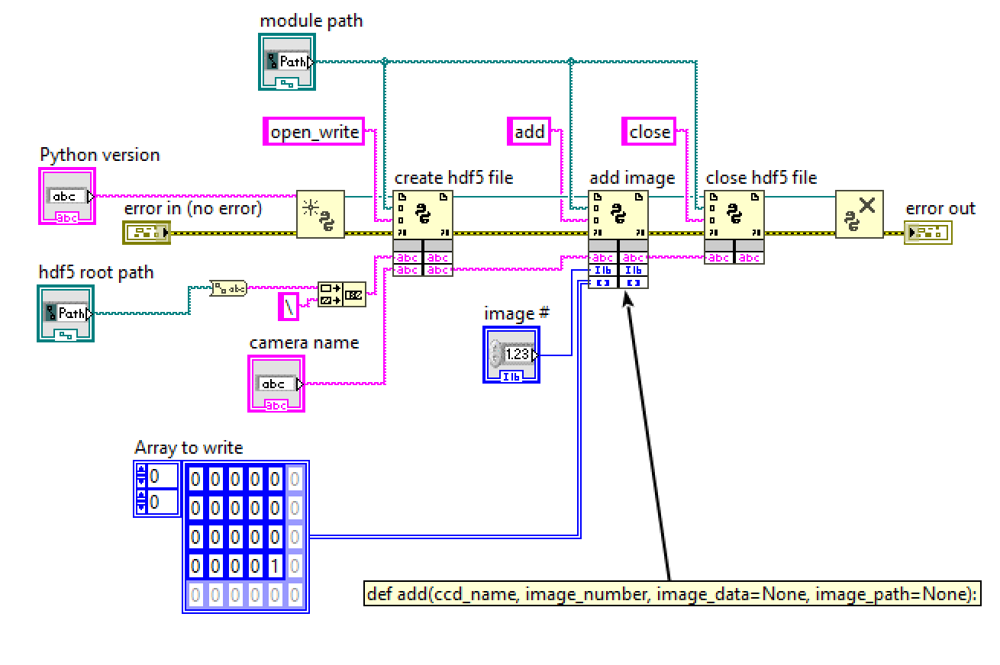

# openPMD-CCD

[](https://github.com/openPMD/openPMD-standard/releases)
[](https://gitter.im/openPMD/Lobby)
![Supported Platforms][api-platforms]
[](LICENSE.txt)  

[api-platforms]: https://img.shields.io/badge/platforms-linux%20|%20osx%20|%20win-blue "Supported Platforms"

This project is a python module for organizing CCD images with openPMD.

openPMD is an open meta-data schema that provides meaning and self-description to data sets in science and engineering.
See the [openPMD standard](https://github.com/openPMD/openPMD-standard) for details of this schema.

## Install

```bash
# optional:            --user
python3 -m pip install        git+https://github.com/openPMD/openPMD-CCD.git
```


## Usage (Write)

### Python

Generally, you can use this as follows:
```py
from openpmd_ccd import CCD

scan = CCD("defaultCam_scan001.h5", overwrite=True,
           name="Go Pro", model="HERO8 Black", serial="12345678",
           operator="Axel Huebl <axelhuebl@lbl.gov>",
           # resolution=None, roi=None, exposure_time=None
)

# just a test: read from a file
scan.add(0, "tests/data/Scan005_SimCam_001.png")
# this is faster and in-memory: data as a Python array
scan.add(1, np.array([[1., 2.], [3., 4.]]))

# scan.recalibrate(...)

scan.close()
```

### LabView

For using this with LabView (2020 or newer), create a ``openpmd_ccd_labview.py`` [wrapper file](https://knowledge.ni.com/KnowledgeArticleDetails?id=kA00Z0000019UFmSAM&l=en-US) and [populate it with the following content (link)](openpmd_ccd_labview.py?raw=1).

You have to **name your CCDs uniquely**.

You can now call the ``open_write``, ``add``, ``recalibrate`` and ``close`` functions with their respective parameters.

General latency estimate when [starting python scripts from LabView](https://zone.ni.com/reference/en-XX/help/371361R-01/glang/python_node/) (measured on a regular Windows PC in 2020):

- Session startup: ~250ms
- First function call into a module: ~1-2ms (simple `numpy` and `h5py` load)
- Further function calls: ~0.3ms

There are three modes to pass an image, exemplified with a 2250x2250 pixel image matrix (16bit depth):
- as numpy array (`image_data` as `numpy.ndarray`):
  - passing to Python: ~20-23ms
- as a list (`image_data` as `list`):
  - passing to Python: ~300ms [(implicit list conversion)](https://twitter.com/axccl/status/1257537488148520962)
  - converting list back to numpy: ~700ms
- via a file path (`image_path` as `string`):
  - overall: 100s of ms and more

The write of the actual data to HDF5 (`add()` call) in the given example takes about 9.1ms per image.
All above values will change depending on Python installation, loaded modules and computer hardware (mainly memory and CPU).

Please see the [example.vi](labview/example.vi) file:

[](labview/example.vi)


## Author Contributions

- [Axel Huebl (LBNL)](https://github.com/ax3l): implementation
- [Anthony Gonsalves (LBNL)](https://atap.lbl.gov/division-leadership/atap-scientific-staff/): consulting and LabView integration


## License Note

Copyright (c) 2020, The Regents of the University of California, through Lawrence Berkeley National Laboratory (subject to receipt of any required approvals from the U.S. Dept. of Energy). All rights reserved.

If you have questions about your rights to use or distribute this software, please contact Berkeley Lab's Intellectual Property Office at IPO@lbl.gov.

This Software was developed under funding from the U.S. Department of Energy and the U.S. Government consequently retains certain rights.
As such, the U.S. Government has been granted for itself and others acting on its behalf a paid-up, nonexclusive, irrevocable, worldwide license in the Software to reproduce, distribute copies to the public, prepare derivative works, and perform publicly and display publicly, and to permit others to do so.

### TL;DR

The license is a [BSD license](https://spdx.org/licenses/BSD-3-Clause-LBNL.html) with an added paragraph at the end that makes it easy for us to accept improvements without a hassle.


### Transitive Contributions

- HDF5 by [the HDF group](https://www.hdfgroup.org/) and community
- the [openPMD-standard](https://github.com/openPMD/openPMD-standard) by Axel Huebl (HZDR, now LBNL) and contributors
